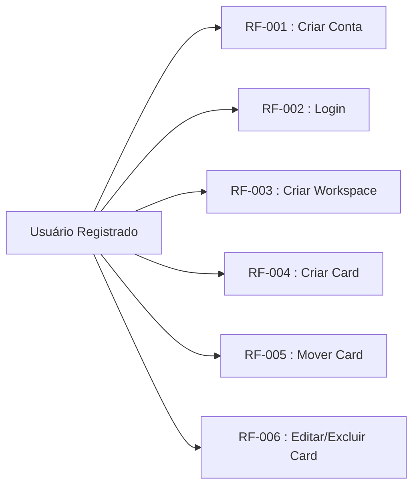
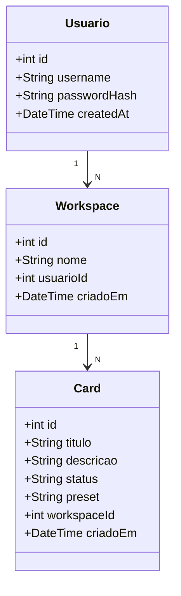
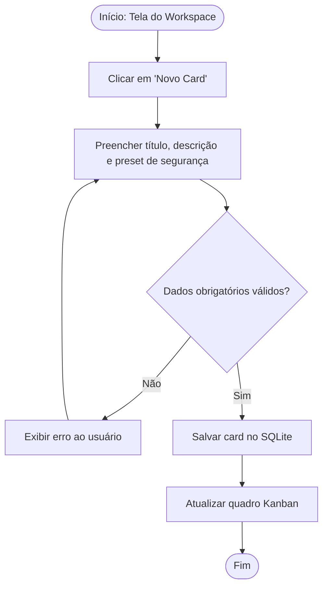

# Documentação de Requisitos de Software (DRS / SDR) - Penkan

**Padrão de Referência** : ISO/IEC/IEEE 29148:2018

**Versão** : 1.0

---

## 1. Introdução

### 1.1 Finalidade

Este documento especifica os requisitos, a arquitetura e as principais funcionalidades do sistema Penkan. O Penkan é um site desktop desenvolvido em PHP com banco de dados SQLite local. O objetivo é fornecer uma ferramenta de organização Kanban para profissionais de segurança ofensiva, com contas de usuário, múltiplos workspaces e presets de cards focados em pentests.

### 1.2 Escopo do Sistema

O sistema Penkan permite que um usuário crie uma conta, faça login e gerencie múltiplos workspaces Kanban. Cada workspace possui as colunas clássicas:

- A Fazer
- Fazendo
- Feito

Os usuários podem criar, editar e mover cards entre colunas, usar presets personalizados relacionados a atividades de segurança ofensiva, e armazenar seus dados localmente com SQLite.

- **No escopo:** Autenticação local de usuário, criação de contas, criação/edição/exclusão de workspaces Kanban, gerenciamento de cards, layout desktop responsivo, persistência SQLite.
- **Fora do escopo:** sincronização em nuvem, colaboração em tempo real, compartilhamento de workspaces entre usuários, integração com serviços externos.

---

## 2. Descrição Geral

### 2.1 Perspectiva do Produto

Penkan é um sistema standalone para desktop executado via navegador local. Ele usa PHP para a interface e lógica, e SQLite para armazenamento de dados. A aplicação não depende de servidores externos para o funcionamento básico, sendo ideal para uso local em máquinas offline ou em redes internas.

### 2.2 Funções do Produto

- Autenticação de usuário com criação de conta, login e logout.
- Criação de múltiplos workspaces Kanban.
- Visualização e organização de colunas: A Fazer, Fazendo e Feito.
- Registro de cards com presets personalizados relacionados a atividades de pentest.
- Movimentação de cards entre colunas para refletir progresso.
- Persistência local usando SQLite.

### 2.3 Perfis de Usuário

- **Usuário Registrado:** profissional ou estudante de segurança ofensiva que deseja organizar testes de penetração e tarefas técnicas em um quadro Kanban.
- **Administrador Local:** pessoa responsável por manter o ambiente de uso, mas sem um painel administrativo separado na versão atual.

---

## 3. Requisitos do Sistema

### 3.1 Requisitos Funcionais [RF]

| Identificador | Requisito                | Descrição                                                                                                       | Prioridade |
| ------------- | ------------------------ | --------------------------------------------------------------------------------------------------------------- | ---------- |
| **RF-001**    | Criação de Conta         | Permitir que o usuário registre uma conta com nome de usuário e senha.                                          | Essencial  |
| **RF-002**    | Login de Usuário         | Permitir login validando credenciais salvas no banco SQLite.                                                    | Essencial  |
| **RF-003**    | Criação de Workspace     | Permitir que o usuário crie múltiplos workspaces Kanban com nomes personalizados.                               | Essencial  |
| **RF-004**    | Criação de Cards         | Permitir que o usuário crie cards dentro de um workspace com título, descrição e presets de segurança ofensiva. | Essencial  |
| **RF-005**    | Movimentação de Cards    | Permitir mover cards entre as colunas A Fazer, Fazendo e Feito.                                                 | Essencial  |
| **RF-006**    | Edição/Exclusão de Cards | Permitir editar e excluir cards existentes.                                                                     | Importante |
| **RF-007**    | Persistência Local       | Salvar todas as informações de usuários, workspaces e cards em banco SQLite.                                    | Essencial  |
| **RF-008**    | Interface Desktop        | Exibir interface adequada para uso em desktop, com navegação clara e painel Kanban.                             | Essencial  |

### 3.2 Requisitos Não Funcionais [RNF]

| Identificador | Requisito      | Descrição                                                                                    | Categoria      |
| ------------- | -------------- | -------------------------------------------------------------------------------------------- | -------------- |
| **RNF-001**   | Segurança      | Senhas devem ser armazenadas com hash adequado antes de gravar no banco de dados.            | Segurança      |
| **RNF-002**   | Desempenho     | A aplicação deve carregar listas de workspaces e cards em menos de 2 segundos em uso normal. | Eficiência     |
| **RNF-003**   | Confiabilidade | A aplicação deve manter dados consistentes mesmo após fechamento e reabertura do navegador.  | Confiabilidade |
| **RNF-004**   | Usabilidade    | A interface deve permitir realizar as operações principais com até três cliques.             | Usabilidade    |
| **RNF-005**   | Portabilidade  | O sistema deve ser compatível com servidores PHP+SQLite em ambiente desktop local.           | Portabilidade  |

---

## 4. Diagrama de Engenharia de Software

### 4.1 Diagrama de Casos de Uso

_Mostra o comportamento do usuário registrado dentro do sistema Penkan._

### 4.2 Diagrama de Classe

### 4.3 Diagrama de Fluxo (Criação de Card Kanban)

---

## 5. Análise de Risco

- **Risco 1:** Perda de dados se o arquivo SQLite for corrompido. Mitigação: realizar backups manuais periódicos e tratar erros de leitura/gravação.
- **Risco 2:** Senhas armazenadas de forma insegura. Mitigação: aplicar hashing seguro ao salvar credenciais.
- **Risco 3:** Incompatibilidade com versões PHP antigas. Mitigação: documentar requisitos mínimos de PHP e SQLite.

---

## 6. Controle de Versão

- Repositório local com histórico de alterações para `index.php`, `login.php`, `registro.php`, `workspace.php`, `workspaces.php`, `conta.php` e `assets/`
- Recomenda-se usar Git para controlar evoluções em lógica de autenticação, modelagem de dados e layout.
